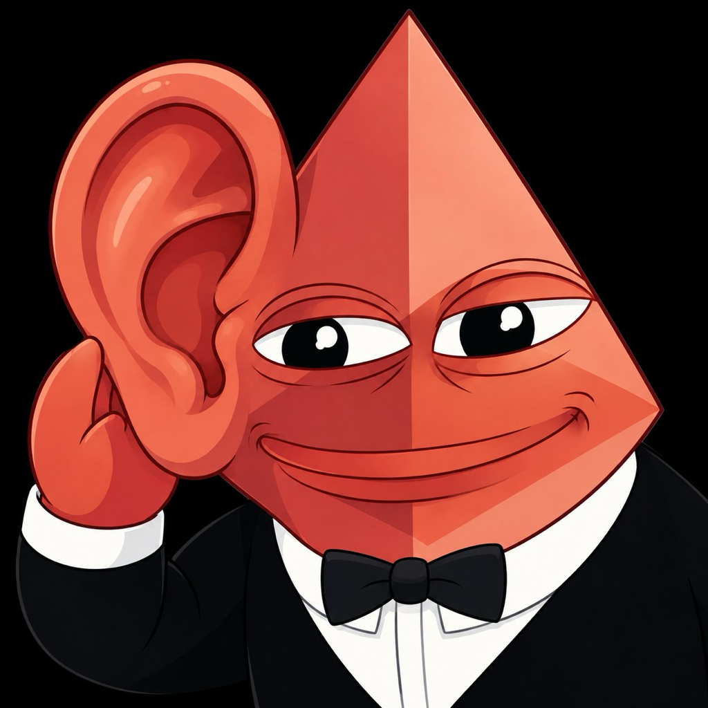

# clawd-dictate



Double-tap **Control**, talk, and the text lands where your cursor is. Any app.

Same recognizer as the harness mic (Deepgram nova-3) and the **same word
list**: the ⚙️ list shared on the relay plus the harness's built-in terms and
replace rules, read straight out of `clawd-harness/index.html`. Add a word in
the harness on your phone and the Mac knows it within five minutes.

While you talk, a floating pill at the bottom of the screen shows the live
text. Double-tap Control again to stop: the text is pasted into the focused
app (your clipboard comes back a second later). Escape throws it away.

## Install

```
git clone https://github.com/clawdbotatg/clawd-dictate ~/clawd/clawd-dictate
cd ~/clawd/clawd-dictate && sh install.sh
```

Needs `~/clawd/clawd-harness` checked out beside it (the built-in word list
and the Deepgram key: `DEEPGRAM_API_KEY=` in `.clawd-harness.env`) and, for
the shared list, `~/bin/fleet-docs` with its credential. The phone build also
needs `~/.config/clawd-dictate/env` with `HARNESS_URL`, `CAL_URL`, `SLOP_URL`
and `DOCS_CREDENTIAL` — your URLs never go in the repo.

`install.sh` builds **clawd-dictate.app** (gitignored): a tiny launcher binary
that embeds Python and runs `dictate.py` from this checkout. macOS keys
permissions to that binary, so they're granted to "clawd-dictate" — not to a
bare `python` — and they survive every `git pull` (the launcher is rebuilt only
when `app/main.c` changes).

First run, macOS asks three times for **clawd-dictate**: **Microphone**,
**Accessibility** (the paste keystroke) and **Input Monitoring** (the Control
double-tap). Allow all three in System Settings → Privacy & Security; the app
restarts itself once it's trusted. A 🎤 in the menu bar means it's running.

## Check without talking

```
.venv/bin/python dictate.py --words            # the terms + rules in effect
.venv/bin/python dictate.py --test speech.wav  # a 16 kHz mono wav → raw + fixed text
```

Log: `~/Library/Logs/clawd-dictate.log`. Stop: `sh install.sh --stop`.

## iPhone: the clawd keyboard (`ios/`)

iOS keyboard extensions can't touch the microphone, so this is the Wispr Flow
shape: **clawd keys** (the keyboard: a 🎤, live text, space/delete/return) asks
**clawd dictate** (the app) to listen. The first tap opens the app so the mic
can start (Apple's rule — swipe back); after that the app listens from the
background for 10 minutes, so the next taps start at once. Same Deepgram
nova-3, same shared word list (read-only relay credential, `stt-words`
only) plus the harness's built-in terms and rules, pulled from GitHub.

```
sh ios/gen-secrets.sh          # Secrets.swift from the env files (gitignored)
cd ios && xcodegen generate    # → ClawdDictate.xcodeproj
xcodebuild -project ClawdDictate.xcodeproj -scheme ClawdDictate -destination 'generic/platform=iOS' -allowProvisioningUpdates build
```

Needs Xcode signed into your Apple ID (automatic signing, team XX7QP5899Z)
and the phone plugged in with Developer Mode on. On the phone: Settings →
General → Keyboard → Keyboards → Add New Keyboard → clawd keys → Allow Full
Access. Open the app once so it can ask for the microphone.
